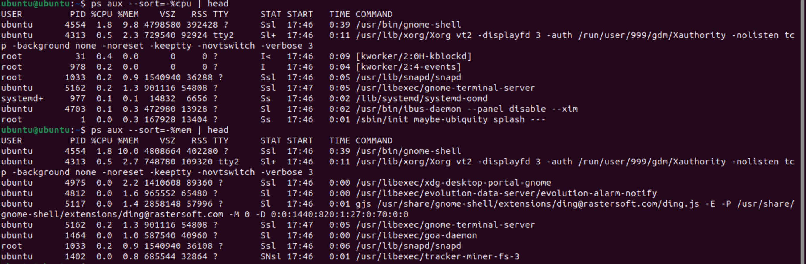
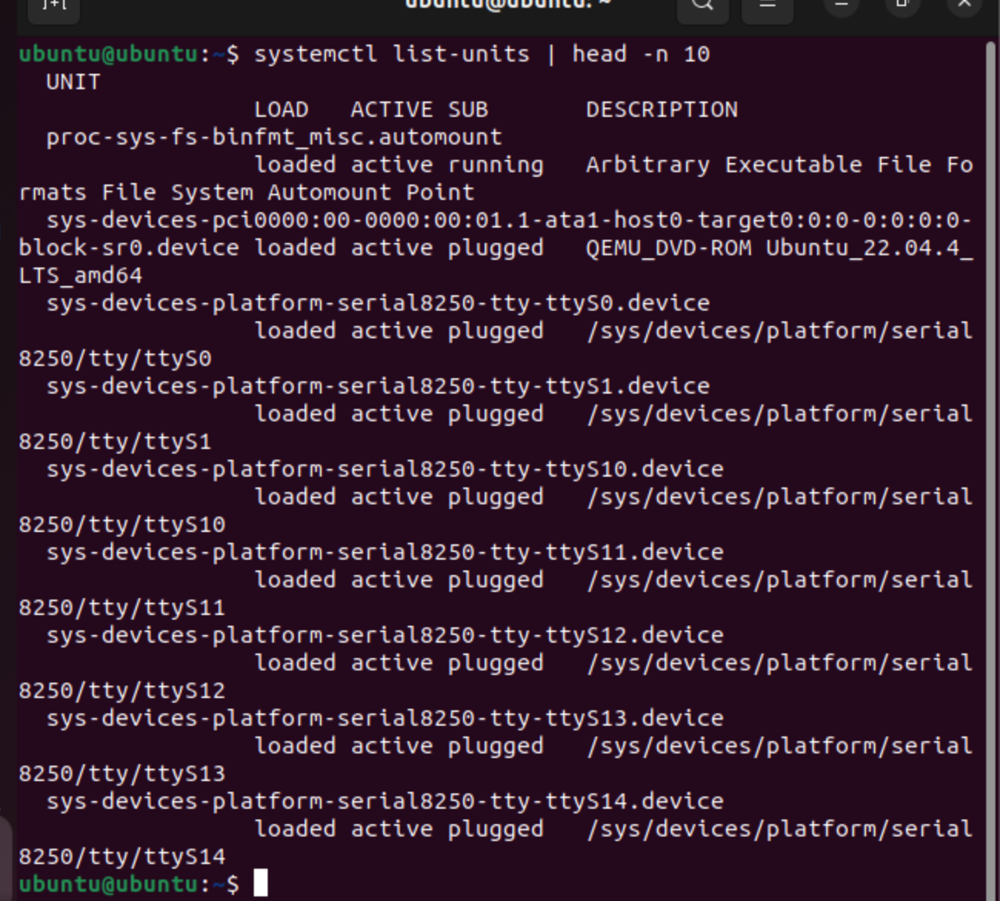
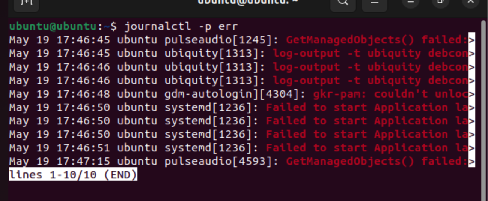
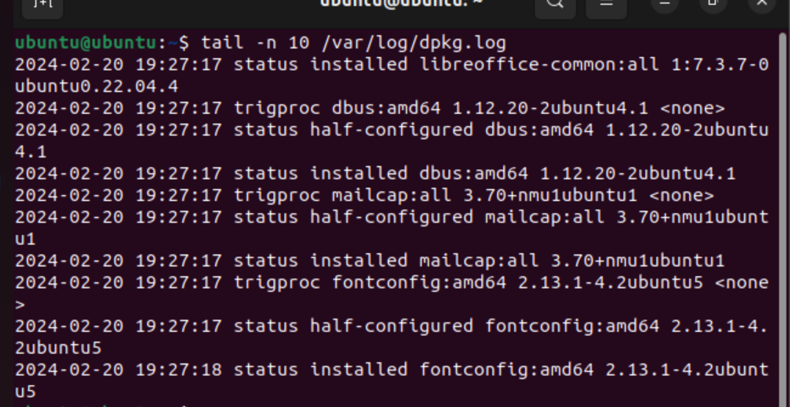

# Real time output of command I practiced

## Process Commands
* `ps -aux --sort=-%cpu | head` -List Running processes on cpu based

* `ps -aux --sort=-%mem | head` -List Running processes on mem basesd

## Services Commands
* `systemctl list-units | head -n 10` - Print first 10 lines of running system services status

# Log Commands
* `journalctl -p err` - Display Errors

* `tail -n 10 /var/log/dpkg.log` - Shows recent package installed

