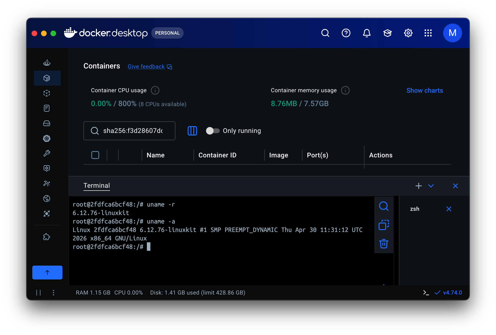
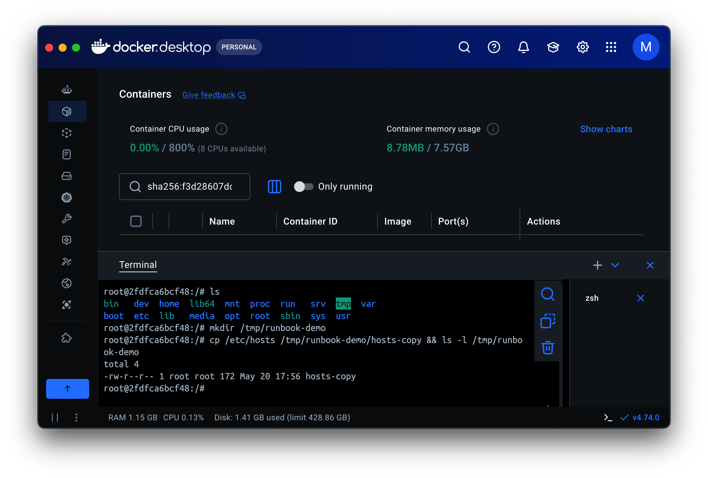
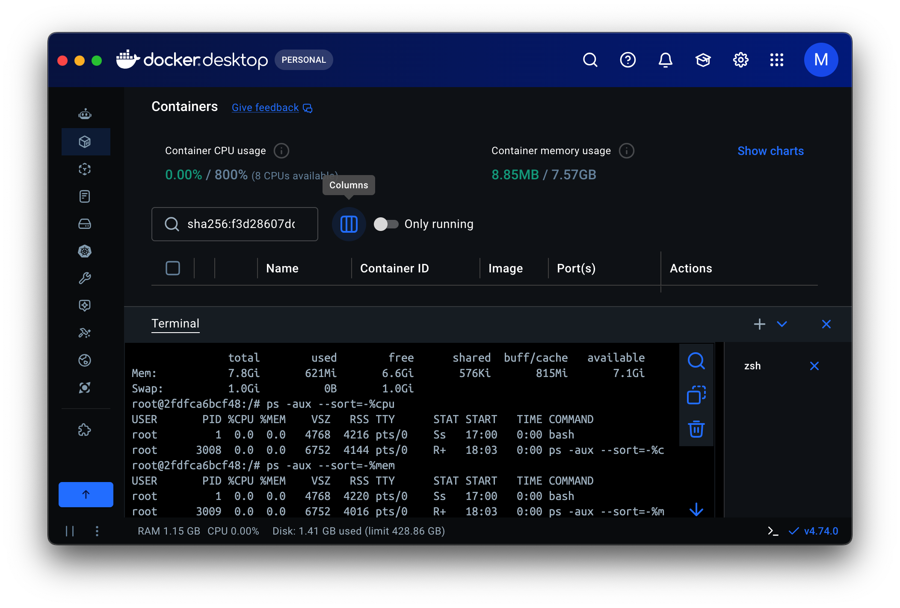
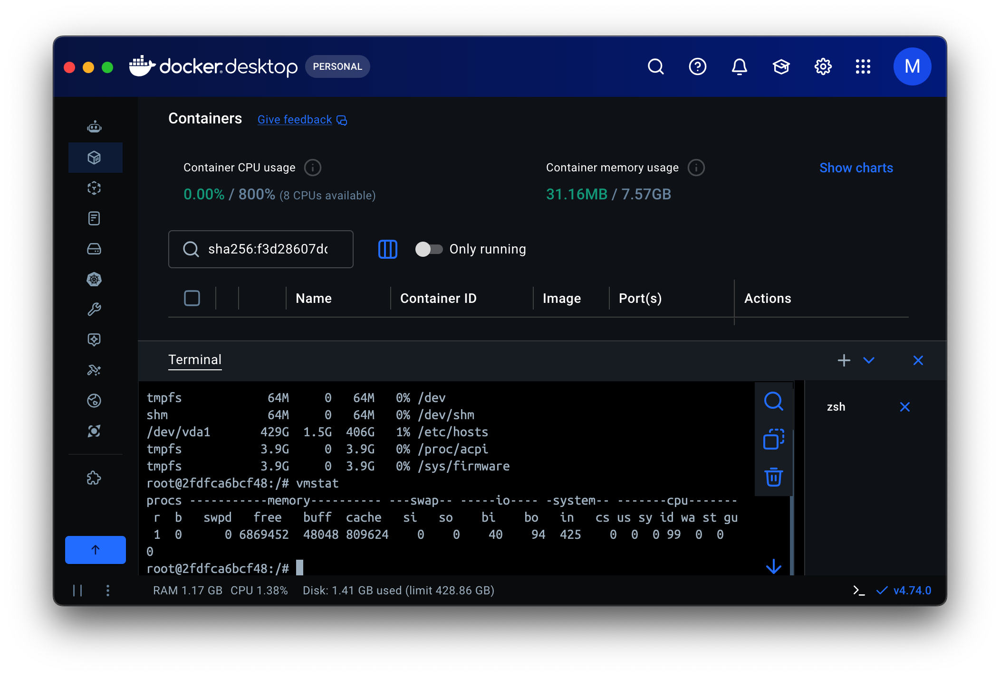
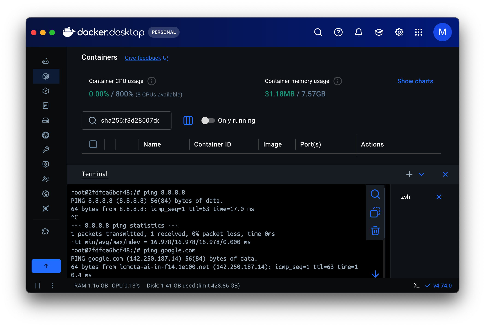
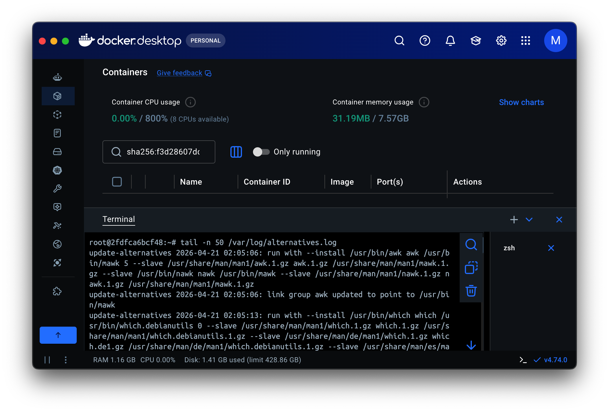

# Runbook for services

### Quick troubleshooting steps if any err pops up.

## Environment Basic

* Command : `uname -r` `uname -a`
Output:  

Troubleshoot : Known Distribution and release versioon of OS

## Filesystem sanity

* Command : `mkdir /temp/runbook-demo`

Troubleshoot : Directory made successfully

* Command : `cp /etc/hosts /tmp/runbook-demo/hosts-copy && ls -l /tmp/runbook-demo`

Troubleshoot : Copied files from /etc/hosts

## CPU / Memory

* Commans : `free -h`, `ps -aux --sort=-%cpu`, `ps -aux --sort=%mem`

Trubleshoot: CPU and Memory usage check, and sufficient memory avaiable

## Disl / IO

* Command : `df -h`, `vmstat`

Troubleshoot: Root partition has more than 95% size available, memoery usage stable 

## Network

* Command : `ping 8.8.8.8`, `ping google.com`

Troubleshoot : Connection Confirmed

## Logs

* Command : ` tail -n 50 /var/log/alternatives.log`

Troubleshoot : Login attempt record. No suspicious activity detected

## Conclusion
- service running normally with low CPU usage
- Disk and logs size is healthy
- Network is open and serving connecction
- No error detected in logs

## Vice Versa
- Restart service
- Check Disk/Mem/CPU usage
- Network port re-check
- check logs again 
