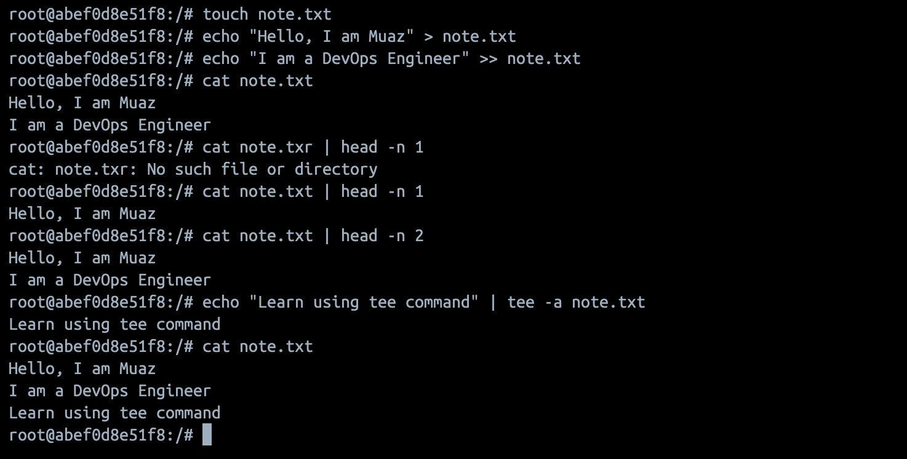

# Read and Write text files in Linux 

* `touch note.txt`

Output: Creates a textfile with name note.txt

* `echo "Hi, I am Muaz Siddiqui" > note.txt

Output : Write text in note.txt file 

* `echo "I am a DevOps Engineer" >> note.txt`

Output : Add another line to note.txt

* `cat note.txt`

Output : Reads note.txt

* `cat note.txt | head -n 1`

Output : Reads first line of note.txt

* `cat note.txt | head -n 1`

Output : Reads last lines of note.txt

* `echo "Learn using tee command" | tee -a note.txt`

Output : Write using tee command which also print the output 

