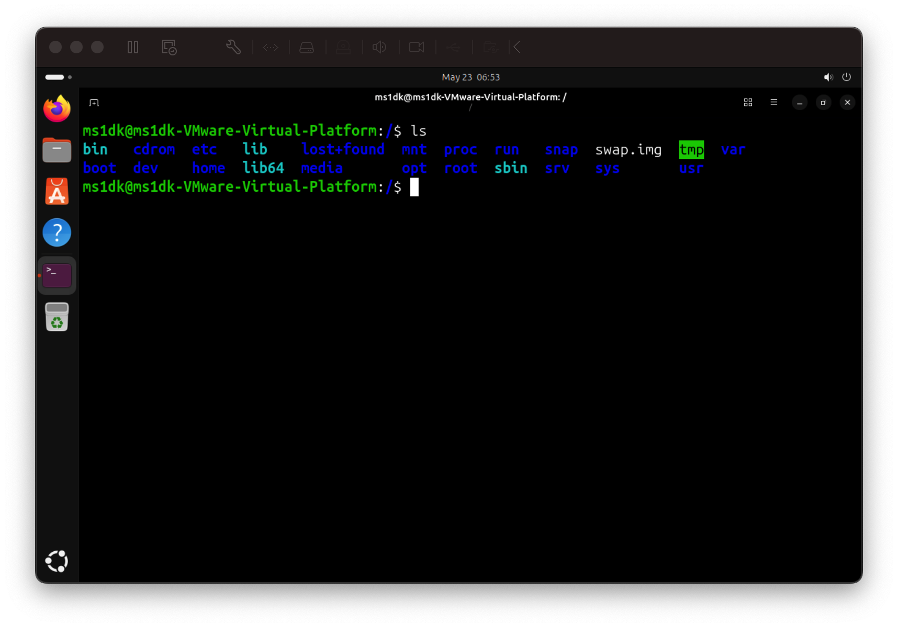
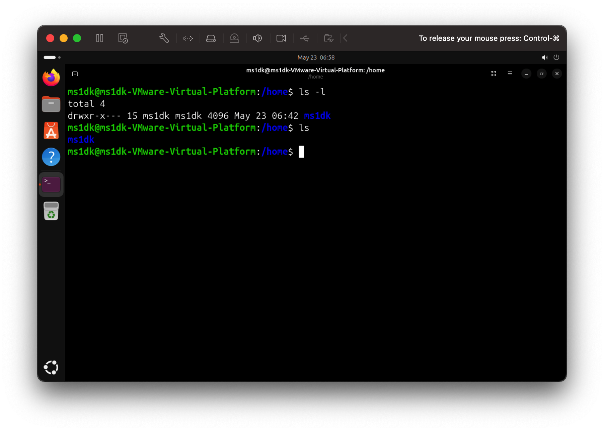
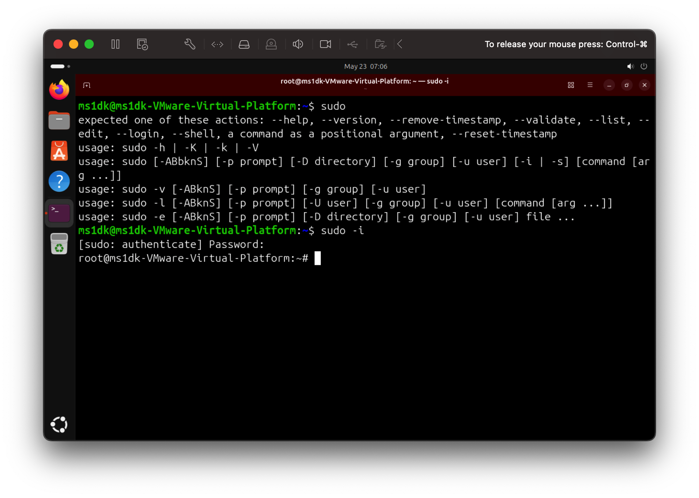
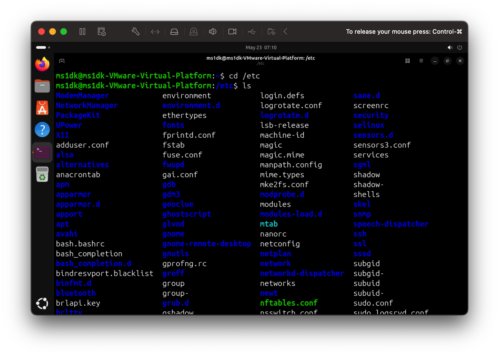
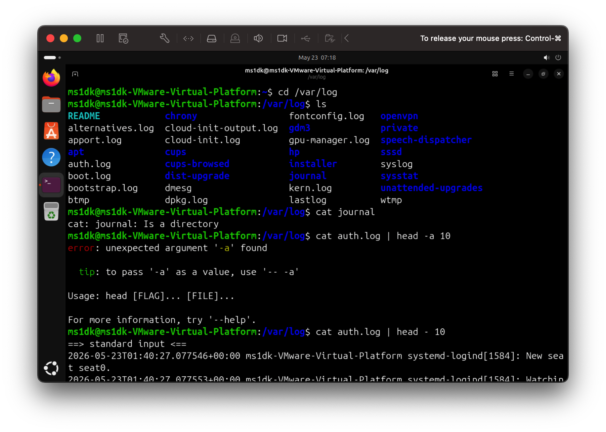
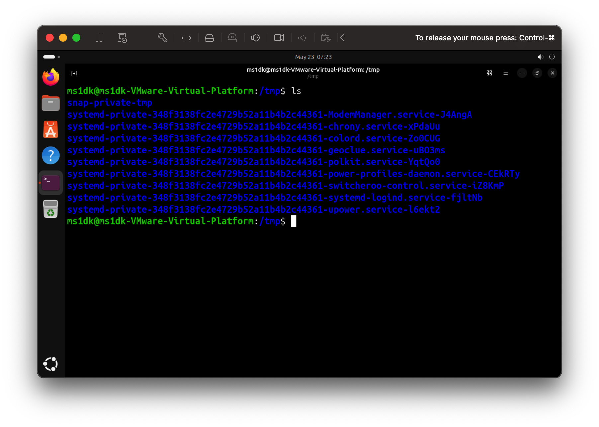
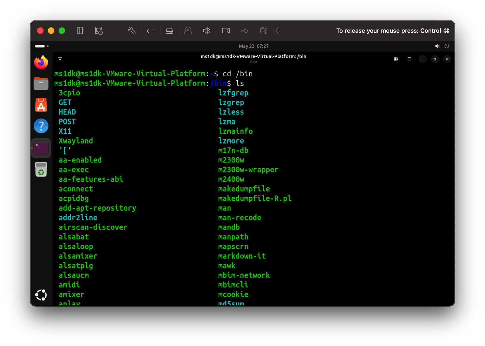
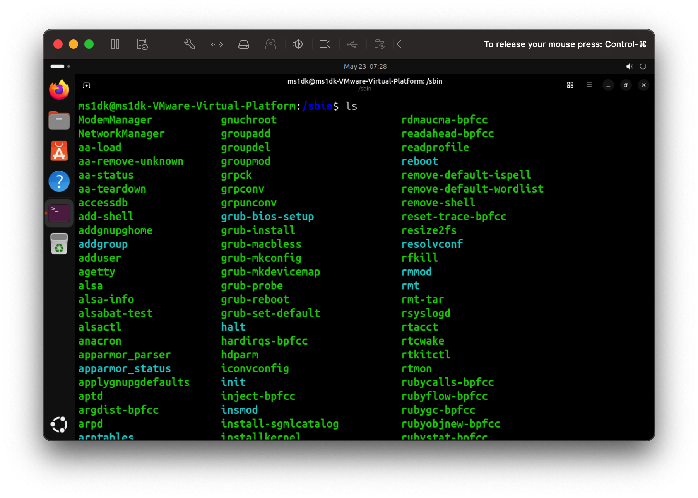

# Linux Filesytem Hierarchy 
## Important Directories of Linux\

* `/ (root)`- is where your entire Linux system lives, the starting point of everything

* `/home` - is where personal files and settings for each user are stored. Every user on the system gets their own folder inside /home.

* `/root` - is the admin personal folder

* `/etc` - is the control panel of your Linux system almost every configuration file for the OS and installed services lives here.

* `/var/log/` -  is a system's black box recorder when something goes wrong, this is always the first place to look for troubleshooting

* `/tmp` -  is where temporary files are stored. Programs and users use it to store files that are only needed for a short time. and will be deleted after reboot

## Additional Directory (Good to know): 

* `bin` - is the toolbox of Linux the essential commands every user needs, always available
* `sbin` -  is where system administration and normal user commands are stored. 

# Scenario Based Prctice 

## Scenario 1: Service not startingi
A service called 'ssh' failed to start after a server reboot.
What commands would you run to diagnose the issue?
Write at least 4 commands in order.

Step 1 : `systemctl status ssh`

Why : To check if the service is running, failed or stopped

Step 2 : `journalctl -u ssh -n50`

Why : To check logs if ssh failed

Step 3 : `systemctl is-enabled ssh`

Why : To check if service starts automatically on reboot 

## Scenrio 2: High CPU Usage
Your manager reports that the application server is slow. You SSH into the server. What command would you run to identify which process is using high CPU 

Step 1 : `top/htop/ps aux`

Why : Check all the running process, Check for processes thar using CPU intensively

Step 2 : `ps aux --sort=-%cpu | head -10'

WHy : Check the processes by CPU percentage. Note down high CPU Usage processes PID

Step 3 : `sudo renice +10 -p PID`

Why : its useful when you dont want to kill the process, lower the process priority and to reduce its usage

Set 4 : `kill PID`

Why : kill the CPU intensive proccess

## Scenario 3: Finding Service Log
A developer asks: "Where are the logs for the 'docker' service?"
The service is managed by systemd.
What command would you use?

Step 1 : `systemctl ststus ssh`

Why : to check service status first

Step 2 : ` journalctl -u ssh -n 50`

WHy ; to chech 50 line of logs

Step 3 : ` journalctl -u ssh -f`

WHy : Check log real time

## Scenario 4: File Permission Issue 
A script at /home/user/backup.sh is not executing.
When you run it: ./backup.sh
You get: "Permission denied"

What commands would you use to fix this?

Step 1 : `ls -l backup.sh`

Why : Check current file permission and look for -rw-r--r--(no 'x' = not executabe permission given to file)

Step 2 : `chmod +x backuo.sh'

Why : Give executable permission to file 

Step 3 : `ls -l backup.sh`

Why : To Verify that the permission is given to execute

Step 4 : `./backup.sh`

WHy : Run the file
