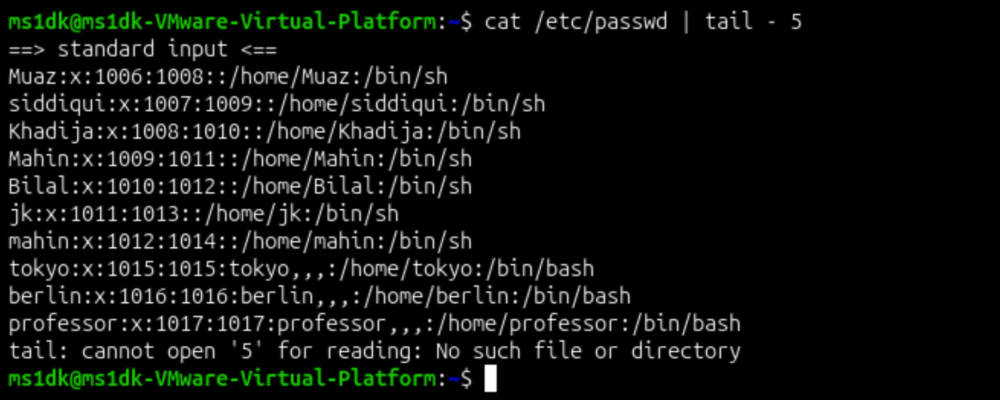
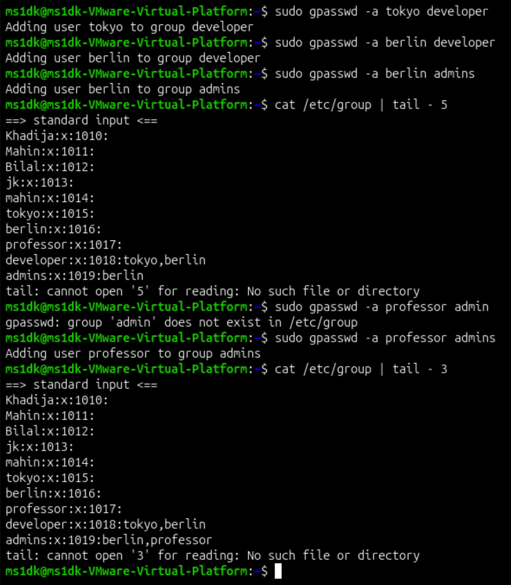
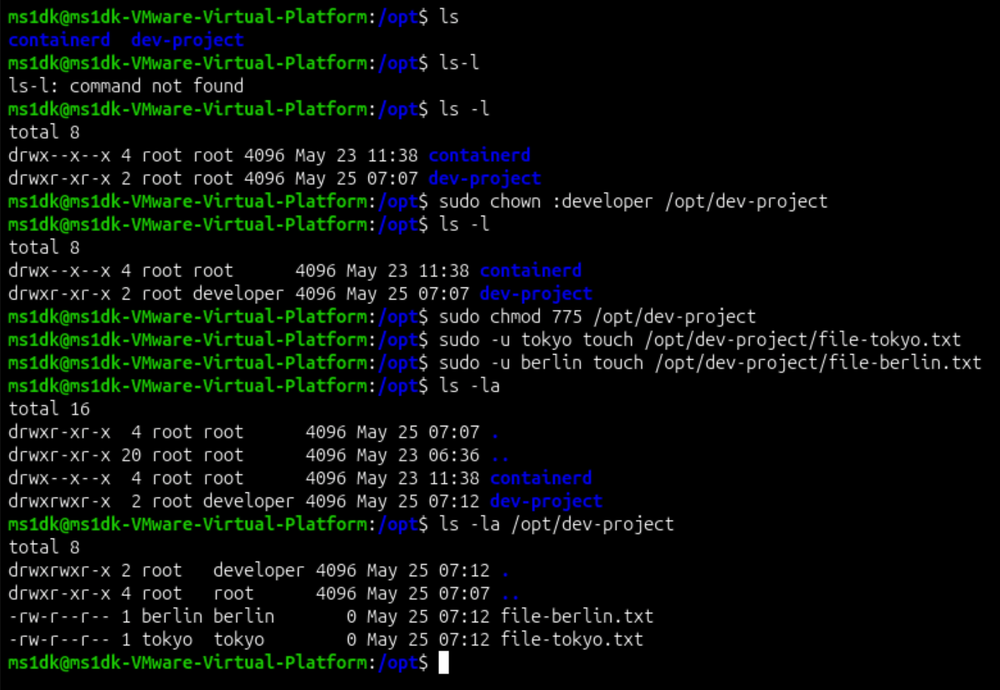
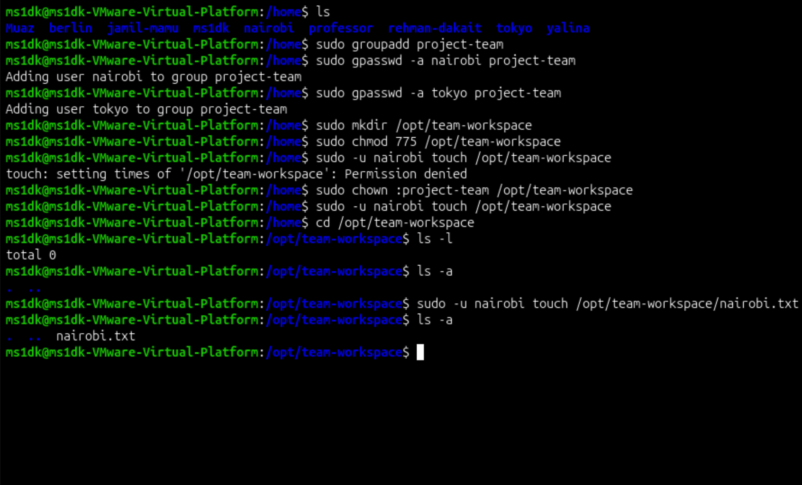

# Linux User and Group Management 

## Created Users

`useradd -m username`

- Users Created : tokyo, berlin, professor

## Created Groups 

` sudo groupadd username`

- Created Groups : developer, admin 

## Group Assignment 

`sudo gpasswd -a (user) (group)`

Verify : cat /etc/group

## Creating Directory

`sudo mkdir /opt/dev-project`

`sudo chown :developer /opt/dev-project`

`sudo chmod 775 /opt/dev-project`

`sudo -u tokyo touch /opt/dev-project/tokyo-file.txt`

`sudo -u berlin touch /opt/dev-project/berlin-file.txt`

`ls -a`

- Directory created, Ownership change, Permission change, Created file with different user 

## Team Workspace

- Create Nairobi user
`sudo adduser -m nairobi`
- Add New Group
`sudo groupadd project-team`
- Add tokyo to new group
`sudo gpasswd -a tokyo project-team`
- Add Nairobi to new group
`sudo gpasswd -a nairobi project-team`
- Make new Directory
`sudo mkdir /opt/team-workspace`
- Change Ownership of group
`sudo chown :project-team /opt/team-workspace`
- Change Permission of group
`sudo chmod 775 /opt/team-workspace`
- Add New File using different user
`sudo -u nairobi touch /opt/team-workspace`
- Verify File
`ls -a`

## Commands Used

- useradd -m username
- sudo groupadd username
- sudo gpasswd -a (user) (group)
- sudo mkdir 
- sudo chown 
- sudo chmod 775
- sudo -u user touch
- ls -a 