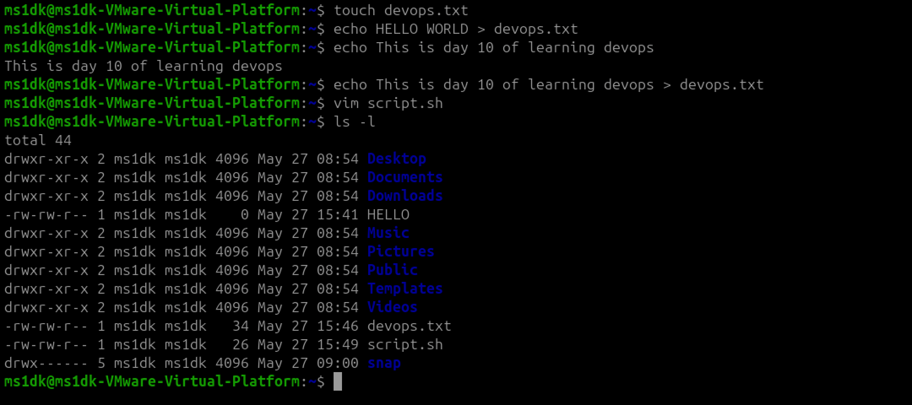
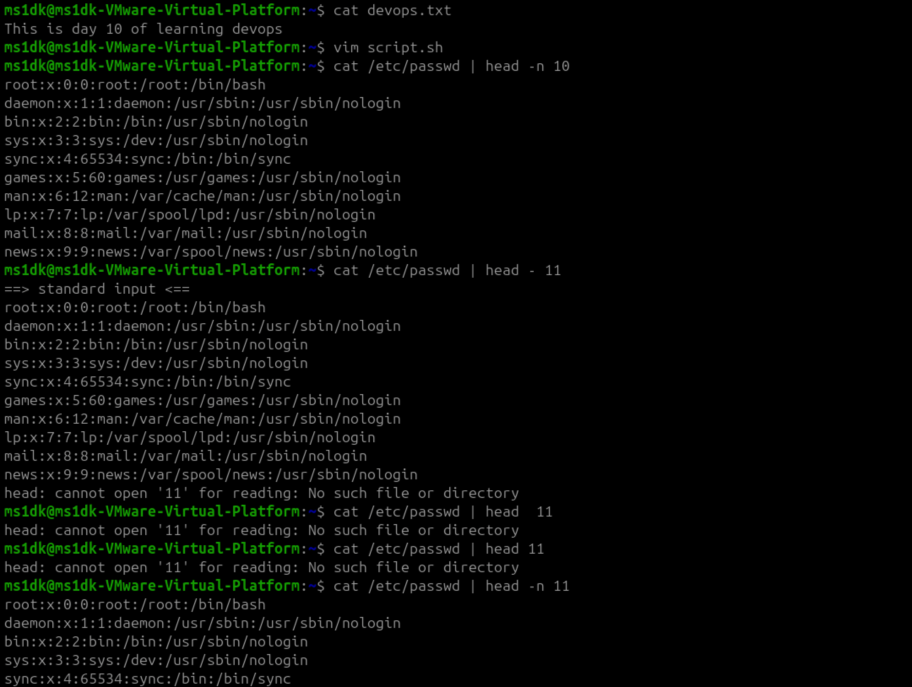
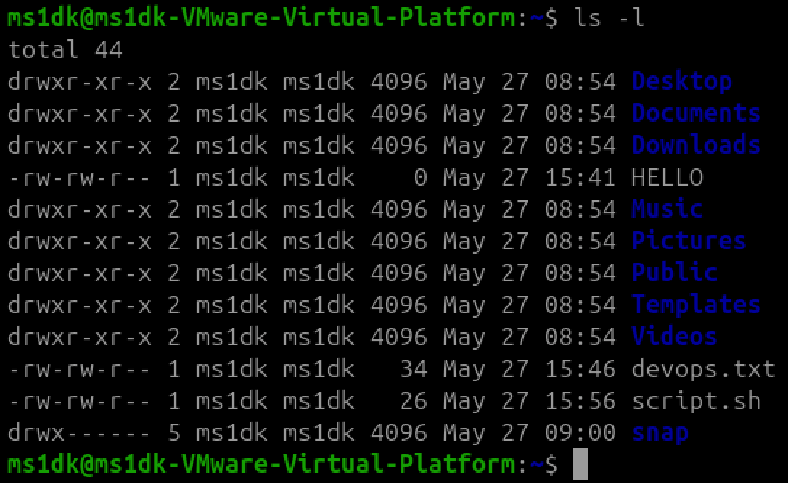
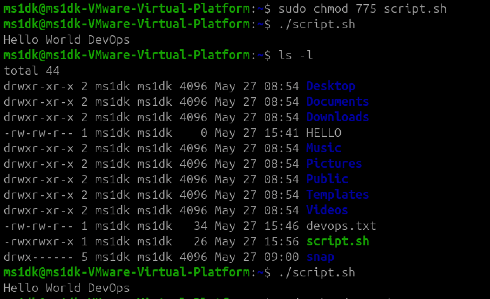
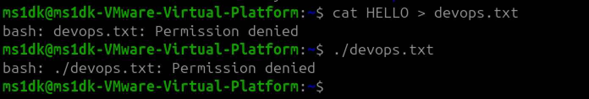

# File Permissions & File Operations Challenge

## Files Created

* Create empty file devops.txt using touch
* Create notes.txt with some content using cat or echo
* Create script.sh using vim with content: echo "Hello DevOps"
* Verify: ls -l to see permissions

## Read Files

* Read notes.txt using cat
* View script.sh in vim read-only mode - `vim -R script.sh`
* Display first 5 lines of /etc/passwd using head 
* Display last 5 lines of /etc/passwd using tail

## Understand Permissions

* Current Permission 

Devops.txt -rw-rw-r--

- `-` -> Shows that it is a regular file.
- `rrw-` -> (user/owner) -> read + write -> no execute
- `rw-` -> (group) -> read + write -> no execute
- `r--` (other) -> read + execute -> no write 

* Same permissions applied to notes.txt and script.sh.

## Modify Permissions  

* Make script.sh executable → run it with ./script.sh

* Set devops.txt to read-only (remove write for all)

* Create directory project/ with permissions 755

## Test Permissions

* Writing to a read-only file - what happens?

It gives permission denied error

* Try executing a file without execute permission.

Executing a file without execute permission gives Permission denied. 

## Commands used

* `touch fname` - Creates empty file.
* `echo "Hello" > fname` - Create file with content.
* `vim fname` - Create/open file in Vim.
* `cat fname` - Prints files content.
* `vim -R fname` - Open file in read only mode.
* `cat /etc/passwd | head -5` - Prints first 5 lines of /etc/passwd.
* `cat /etc/passwd | tail -5` - Prints last 5 lines of /etc/passwd.
* `chmod 777 fname` - Adding executable permission for all(owner,group,others).
* `chmod 555 fname` - Removing write permission for all(owner,group,others).
* `mkdir 755 dname` - Create directory with permissions(rwx,r-x,r-x).

## Conclusion

* Managing files permissions effectively.

