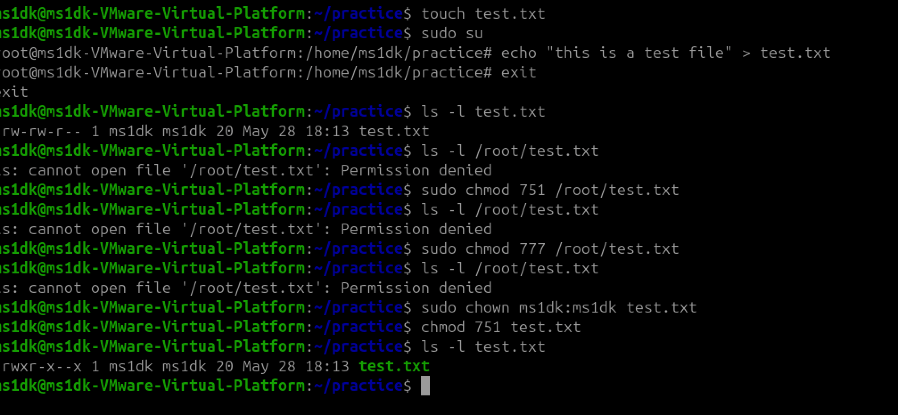

# Revision (Days 01–11)

* My goal for 2026 is to become a DevOps Engineer at all cost, confidently learrning new things every singe-day and flourishing my skill in Linux administrarion. My goal is to land a white collar job in this field by the end of 2026

## Processes & services

When my system hangs or slows down, I use the following commands to troubleshoot and check service health:

`ps aux` → Lists all running processes on the system.

`top`→ Display sorted information about processes.

`systemctl status <service>` → Displays the status of a specific service (whether it’s active, failed, or inactive).

`journalctl -u <service>`→ Displays logs for a specific service, useful for debugging issues.

## File skills

I have practiced creating/modifying/permission of Linux file/folder.
Here is how to safely change ownership and permissions:

- Check current ownership and permissions

`ls -l /path/to/file`

- Change ownership (user and group)
  
`sudo chown user:group /path/to/file`

- Change permissions (least privilege principle)
  
 `chmod 751 /path/to/file`
 
- Example :

## Cheat sheet refresh

Top commands I'd use in an incident :

- `ps aux` -  Lists all running processes with CPU/memory usage
- `mpstat` - Monitors CPU utilization across cores, highlighting bottlenecks or unusual load.
- `systemctl status service` - Verifies if a critical service is active, failed, or restarting.
- `cat /var/log/nginx/error.log`- Reads raw logs for web server errors (replace with relevant service log path).
- `journalctl -u service` - Retrieves detailed logs for a given service, useful for debugging failures.
- `free -m` - Displays memory usage in MB to check for exhaustion or leaks.

## What will I focus on improving next thrree days

* Will Focusing on networking 
* Practice Linux Filesystem/File Permission (Ownerr/Group)
* Practice Bash Scrripting