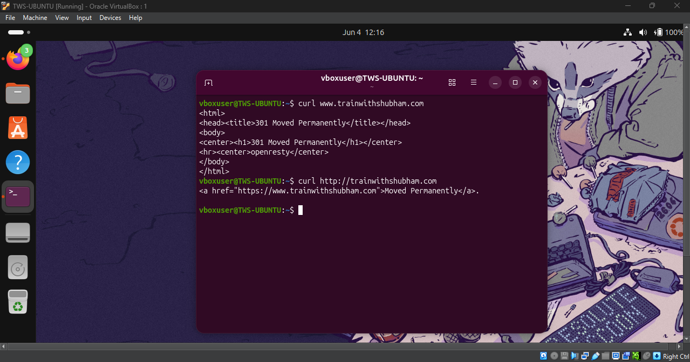
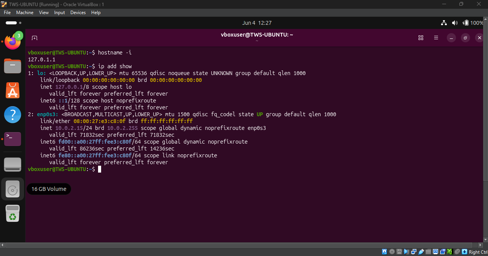
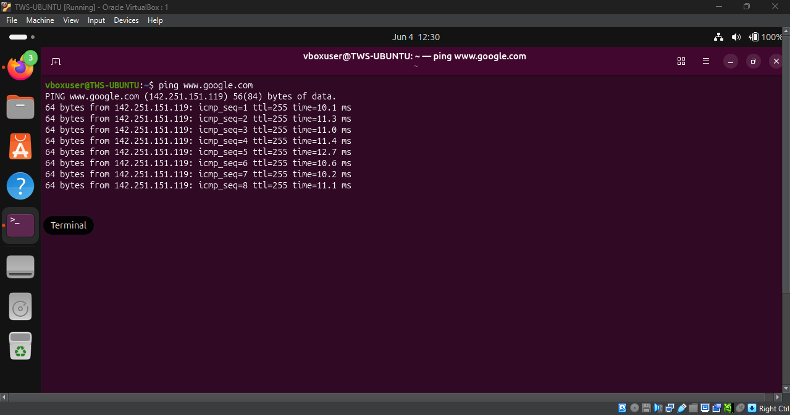
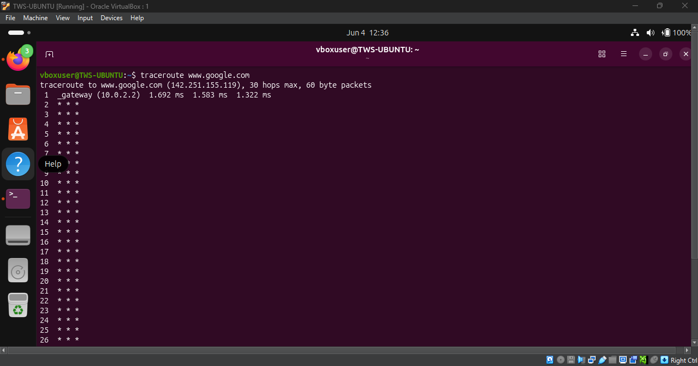
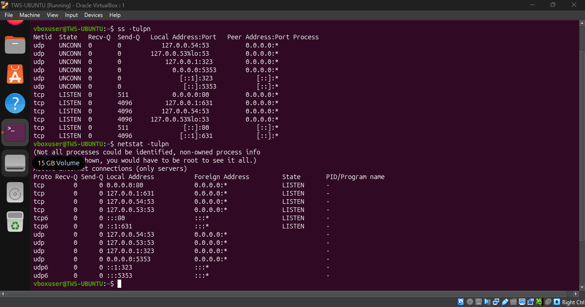
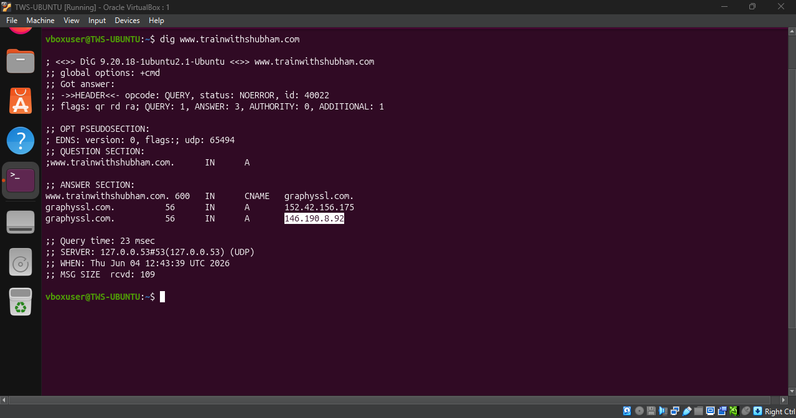
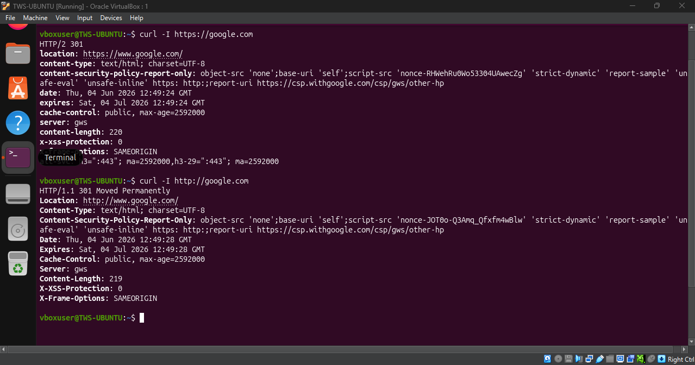
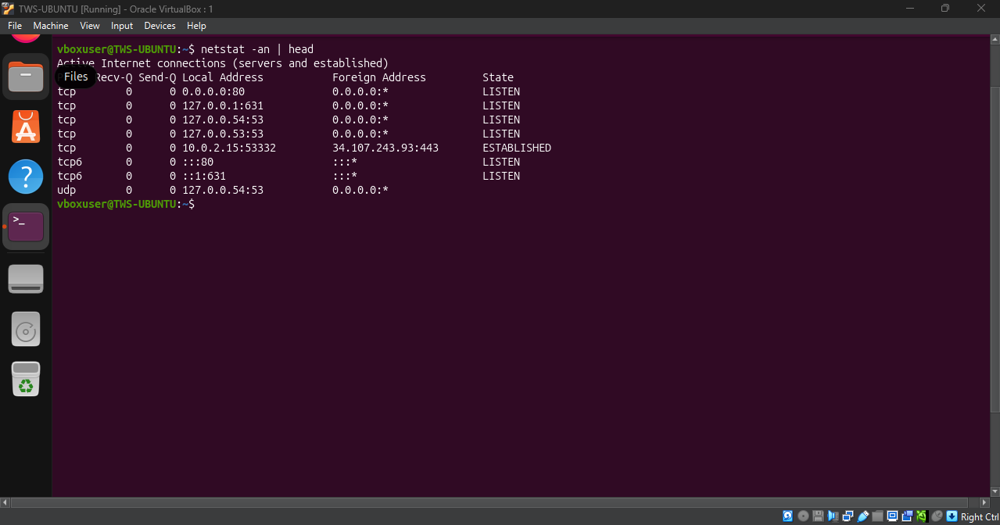
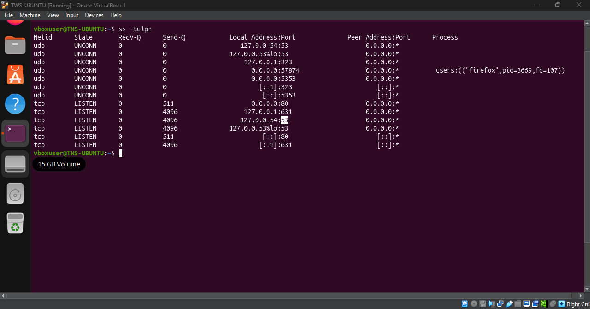
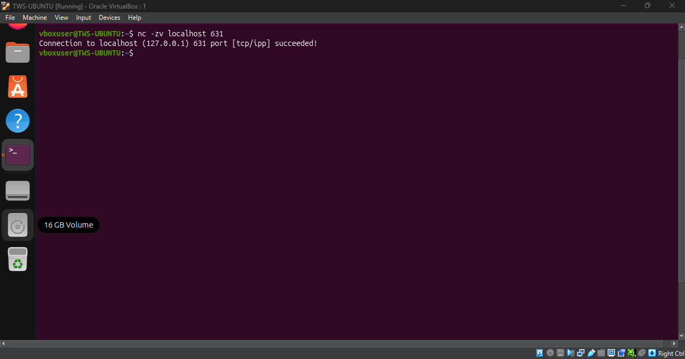

# Networking Fundamental & Hand-On Checks

##  OSI vs TCP/IP models

### OSI Model -
OSI is a theoritical model which define networking communication. It is consist of 7 where each layer performs its own function.
* Application Layer L7 - User Interface (eg., browser)
* Presentation Layer L6 - Data Encryption/Decryption
* Session Layer L5 - Session is made/Establish
* Transport Layer L4 - Reliable Devlivery (TCP/UDP)
* Network Layer L3 - IP Address Assign, Routing
* Data Link L2 - MAC Addressn Exchange for Device
* Physical L1 - Physical Device (Router, Laptop, Switch, Cable)

### TCP/IP Model
TCP/IP is a practical model used to establish communication Client and Host. It is Consist of four Layers

* Application L4 - Combines OSI's Application + Presesntation + Session
* Transport L3 - Same as OSI's Transport
* Network Layer - Same as OSI's Network 
* Network Access Layer - Combines OSI's Datalink + Physical 

### Protocol Placement 

* HTTP, HTTPS, SMTP, DNS, DHCP, SSH - Application Layer
* TCP, UDP - Transport Layer 
* IP - Internet Layer
* Ethernet, WI-FI - Network Access Layer

### Real Example 

-> HTTP (Application) -> over TCP (Transport) -> over IP (Internet)

## Hands-on Checklist 

* Identity : `hostname -I` `ip add show`

**Observation:** Local private IP address is 127.0.01

* Reachability: `ping <target>`

**Observation:** 0% packet loss with 4006ms average latency confirms good network connectivity.

* Path: `traceroute <target>`

**Observation:** 30 hops max with 1.583 ms latency.

* Ports: `ss -tulpn` or `netstat -tulpn`

**Observation:** Service - ssh. SSH is listening on port 53.

* Name resolution: `dig <domain>` or `nslookup <domain>`

**Observation:** Domain resolves to 146.190.92.

* HTTP check: `curl -I <http/https-url>`

 **Observation:** Received response HTTP/1.1 200 OK. Server successfully responded and the resource is available.

 

 * Connections snapshot: `netstat -an | head`

  **Observation:** LISTEN: 6 entries (ports 631, 80, 53, 54, 22, 5332).
 ESTABLISHED: 1 entry (HTTPS connections).

 

 ## Mini Task: Port Probe & Interpret

 - SSH service on port 53

 

 - Connection Made

 

 **If not reachable :** 
- Check service status - `systemctl status ssh`
- Check logs - `journlctl -u ssh`
- Check firewall - `sudo ufw status`

## Reflection

- **Ping** command gives fastest signal if something is broken.
- DNS fails : It runs on application layer if DNS queries don’t resolve, the next logical layer to inspect is 
  the Transport layer (L4) and Internet layer (L3)
  
  -> dig, nslookup, ping, ss -tulpn
- HTTP 500 : It is application layer. Since you got response(500) it means internet and transport layers are fine.
  Check at Application layer.
  
  -> systemctl status service, journalctl -u service, tail -f /var/log/service/error.log
- Follow up checks in real incident :
    * Check firewall (`sudo ufw status`,`sudo iptables -L -n -v`)
    * Service helth check (`systemctl status <service>`)
    * Connectivity test (`curl -I http://<server-ip>:<port>`,`nc -zv <server-ip> <port>`)

