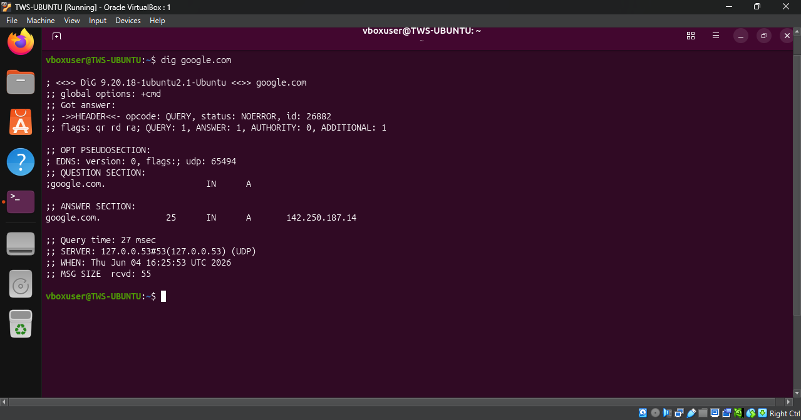
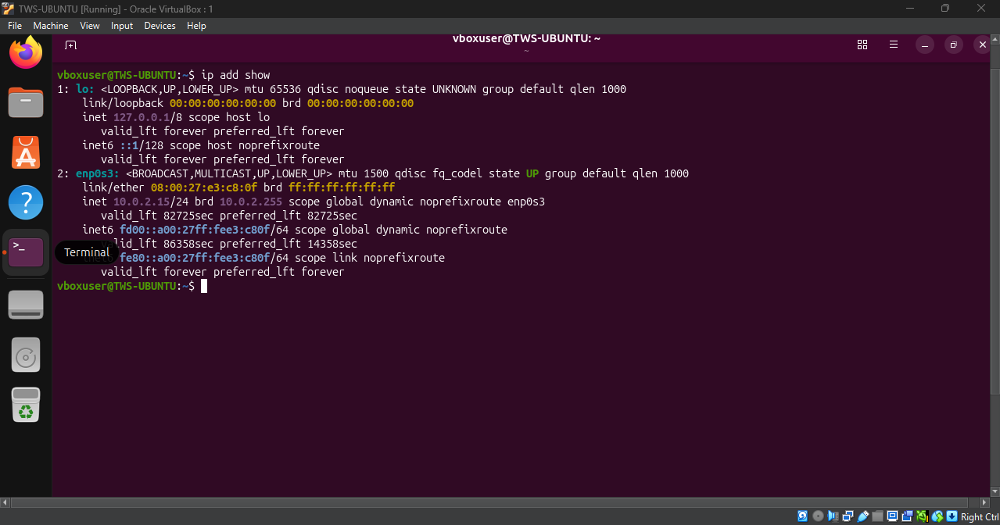

# Networking Concepts: DNS, IP, Subnets & Ports

### Task: 1 DNS - How Names Become IPs
1. What happens when you type `google.com` in a browser?

**Answer** 

    1- First the browser checks in local cache for the IP address when not found then it passes to DNS(DOMAIN NAME SERVICE) requesting IP address.

    2- The browser sets up a secure connection (HTTP) with google server using TCP/IP.

    3- The IP address is routed to the webserver

    4- The web server processes the request then send backs to webpage we see

   2. What are these record types? Write one line each:
   - `A`- Maps a domain name to IPv4.
   - `AAAA`- Maps a domain name to IPv6.
   - `CNAMW`- Create and alias from one domain to another.
   - `MX`- Specifies mail server responsible for handling email for the domain. 
   - `NS`- Defines the authoritive name server for the domain.

   3. Run: `dig google.com` 

* `A` - Record gives IPv4 address - 142.250.187.14
* `TTL` - Time to Live - 25

### Task 2: IP Addressing

1. What is an IPv4 address? How is it structured?

***Answer*** - And IP Address is unique numercial value assigned to devices connected to Internet. It is consist of 32Bit divided into four octet (Each Octet contains 8 bit).

2. Difference between **public** and **private** IPs.

# Public IP
***Answer*** :
It is assigned by ISP to every device on internet and it is routable 

# Private IP
***Answer*** :
It is used inside local network and not routable on the internet

3. What are the private IP ranges?
  - `10.x.x.x` - Large enterprise networks
   - `172.16.x.x – 172.31.x.x` - Medium-sized organizations
   - `192.168.x.x` - Home & small office networks

   4. Run: `ip addr show` — identify which of your IPs are private

   

                                                        
 ### Task 3: CIDR & Subnetting

 1. What does `/24` mean in `192.168.1.0/24`?

 ***Answer*** - The /24 is the CIDR prefix length. It means the first 24 bits of the IP address are used for the network portion, leaving 8 bits for host addresses.

  2. How many usable hosts in :
  - `/24` : 254
  - `/16` : 65,534                                
  - `/28 : 14

  3. Why do we subnet?

  ***Answer*** - Because subnetting allows us to split a large network into smaller networks to improve performance, security, and IP address management. 

4. Quick exercise — fill in:

| CIDR | Subnet Mask     | Total IPs | Usable Hosts |
|------|-----------------|-----------|--------------|
| /24  | 255.255.255.0   | 256       | 254          |
| /16  | 255.255.0.0     | 65,536    | 65,534       |
| /28  | 255.255.255.240 | 16        | 14           |

### Task 4: Ports – The Doors to Services
1. What is a port? Why do we need them?

***Answer*** - A port is a logical communication endpoint used by applications and services on a computer. We need ports because a single computer can run many services at the same time. Ports allow network traffic to be directed to the correct application.

| Port | Service |
|------|---------|
| 22   | SSH     |
| 80   | Nginx   |
| 443  | HTTPS   |
| 53   | DNS     |
| 3306 | MySQL   |
| 6379 | Redis   |
| 27017| MongoDB |

3. Run `ss -tulpn` — match at least 2 listening ports to their services

- Port 53 :  DNS
- Port 80 : Apache2

### Task 5: Putting It Together

- When you run `curl http://localhost:80`
   * Protocol HTTP
   * Localhost : Resolve to loopback IP it resolves to 127.0.0.1
   * Port 80 : Apache service 

   - Your app can't reach a database at `10.0.1.50:3306` — what would you check first?

   * `ping` - I would first verify that the database server is reachable by checking network connectivity 
   * `ss -tulpn | grep 3306` - Check if port is open and service is listening.
   * `systemctl status (service)` - Check service status 
   * `nc -zv 10.0.1.50 3306` - Check the connectivity 
   * `journalctl -u (service)` - check log